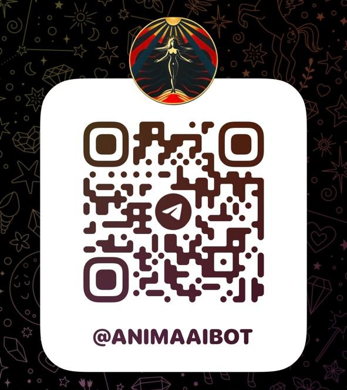

# anima.ai

Anima.ai is a Python-based AI dream-interpretation assistant with OpenAI integration, LangChain pipelines, chat history, embeddings, multi-approach analysis, payment system, database layer, and a Telegram bot interface. Modular, scalable architecture for rich spiritual and psychological insights.

## Telegram Bot

  

## 👤 Author

https://github.com/regisdantas \
https://www.linkedin.com/in/regismdantas
